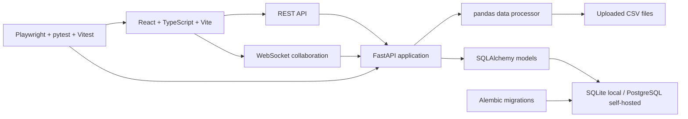

<p align="center">
  
</p>

<h1 align="center">SigmaLite</h1>

<p align="center">
  <strong>Spreadsheet-style data exploration that turns CSV files into editable, chartable, collaborative workspaces.</strong>
</p>

<p align="center">
  <a href="https://github.com/Taz33m/sigma-lite/actions/workflows/ci.yml"></a>
  <a href="LICENSE"></a>
  
  
  
  <a href="https://youtu.be/aDMvTl-uKQ0"></a>
  
</p>

<p align="center">
  
</p>

<p align="center">
  <strong>Demo video:</strong>
  <a href="https://youtu.be/aDMvTl-uKQ0">youtu.be/aDMvTl-uKQ0</a>
</p>

> **TL;DR:** SigmaLite is a full-stack CSV workspace: upload a dataset, infer its schema, inspect and edit rows in a paginated grid, filter and aggregate values, save charts, attach comments, and see realtime collaboration signals. It is intentionally smaller than a BI platform and more structured than a raw spreadsheet.

SigmaLite is an independent project and is not affiliated with Sigma Computing.

## Why This Exists

CSV files are everywhere, but a CSV is not a workspace. It has rows, columns,
and values, but it does not carry schema context, saved analysis, chart
configuration, comments, user ownership, or team activity.

SigmaLite turns a raw file into a working data surface. The goal is not to
recreate Excel or ship a giant BI suite. The goal is a focused, inspectable
reference implementation of a modern spreadsheet-style analytics loop:

1. Upload a CSV.
2. Infer structure and preview rows.
3. Work in an editable grid.
4. Filter, aggregate, and calculate.
5. Save visualizations.
6. Discuss the numbers in context.
7. Keep the implementation honest with tests, migrations, CI, and E2E coverage.

## Best Way To Review

1. Watch the short demo video above.
2. Run the backend test suite and migration smoke.
3. Run the frontend unit tests and production build.
4. Run the Playwright product loop.
5. Open the app locally, upload a sample CSV, create a sheet, edit a cell,
   apply a filter, save a chart, add a comment, and export the visible rows.

```bash
# Backend
cd backend
uv run python -m pytest -q

# Frontend
cd ../frontend
npm test -- --run
npm run build
npm run test:e2e -- --project=chromium
```

## Product Walkthrough

### 1. Upload

Users upload a CSV from the dashboard. The backend validates the extension and
size, stores the file under a safe unique server-side name, records the original
display filename, and infers schema metadata with pandas.

### 2. Inspect

The dataset opens as a paginated MUI Data Grid with inferred columns, source row
indexes, dataset metadata, and editable cells.

### 3. Analyze

Users can apply validated filters, run aggregate operations, and enter supported
spreadsheet-style formulas such as:

```text
=SUM(age)
=AVG(B:B)
=MEDIAN(C1:C25)
```

Supported aggregate operations are `SUM`, `AVG`, `MIN`, `MAX`, `COUNT`, and
`MEDIAN` over named columns, whole-column references, and single-column A1
ranges. Formulas that reference their own cell directly or through a range are
rejected.

### 4. Visualize

Selected columns can be turned into saved chart configurations. The frontend
renders bar, line, scatter, and pie charts with Chart.js, and supports PNG
export from the chart preview.

### 5. Collaborate

Sheets support persisted comments attached to the sheet or to a specific cell.
The WebSocket layer broadcasts presence, cursor activity, cell-update activity,
and comment activity for collaborators viewing the same sheet.

## What It Implements

| Area | Capability | Why it matters |
| --- | --- | --- |
| Authentication | Register, login, refresh tokens, current-user profile, bcrypt password hashing, JWT user isolation | Keeps datasets scoped to their owners |
| Dataset intake | CSV upload, file-size guard, safe display filename, unique stored filename, schema inference | Turns loose files into managed data assets |
| Grid workspace | Paginated MUI Data Grid, editable cells, persisted updates, comment markers | Makes the file usable as a working surface |
| Filters | Validated filter API plus frontend filter builder | Lets users narrow data without writing code |
| Formulas | Aggregate formulas over named columns, A1 ranges, and whole-column references | Gives spreadsheet-style calculation without pretending to be a full Excel engine |
| Charts | Saved chart configs, bar/line/scatter/pie rendering, PNG export | Converts selected data into reusable visual output |
| Comments | Sheet and cell comments with owner and timestamp metadata | Keeps discussion attached to the analysis |
| Realtime | WebSocket presence, cursors, cell updates, comments, connection caps, and presence fanout limits | Shows collaborative activity in context without leaving presence traffic unbounded |
| Export | Full filtered CSV/XLSX/PDF export with CSV formula-injection neutralization | Makes the working view portable without spreadsheet security footguns |
| Operations | Structured logs, health/readiness checks, protected metrics, Redis-backed rate limits, runbooks, CI, Playwright E2E | Makes the repo reviewable as an engineered product |

## Current Artifact Proof

The repository includes automated proof surfaces for the implemented product
loop.

| Proof surface | Verified scope |
| --- | --- |
| Backend pytest suite | Auth/session rotation, datasets, sheets, charts, sharing, exports, audit, OpenAPI export, deployment config, WebSockets, load tools, staging smoke, config hardening, and a 10k-row product smoke |
| Frontend unit tests | Auth state, API contracts, sheet-scoped data APIs, WebSocket ticket URLs/messages, remote cell-update toasts, grid row identity, and CSV export safety |
| E2E product loop | Playwright test for auth, upload, sheet creation, edit, filter, chart, comment, and export |
| Migration smoke | Fresh Alembic upgrade checks expected tables including dataset row/cell storage, shares, audit events, refresh tokens, WebSocket tickets, and `alembic_version` |
| Production build | ESLint, TypeScript, and Vite build in CI |
| Dependency audit | `pip-audit -r backend/requirements.txt` and `npm audit --omit=dev --audit-level=moderate` in CI |
| Self-hosting artifacts | Render/Vercel examples for the FastAPI service, Postgres, Redis, readiness health check, and Vite SPA; deployed API smoke script in `backend/load/staging_smoke.py` |

See [`PRD_COMPLIANCE.md`](PRD_COMPLIANCE.md) for the current feature matrix and
beta limits.

## Architecture



Core responsibilities:

- `frontend/`: authentication UI, dashboard, sheet workspace, MUI grid, filters,
  aggregate controls, chart preview, saved chart cards, comments, sharing,
  full export, and Playwright product-loop coverage.
- `backend/`: FastAPI routes, JWT auth, row/cell storage, sharing permissions,
  upload validation, pandas data processing, cell persistence, sheet/chart/comment
  models, audit logs, Alembic migrations, config guardrails, and WebSocket broadcasts.

More detail: [`docs/ARCHITECTURE.md`](docs/ARCHITECTURE.md).

## Quick Start

### Prerequisites

| Tool | Version | Notes |
| --- | --- | --- |
| Python | 3.11+ | Backend runtime and tests |
| Node.js | 22 recommended | Matches CI and Playwright setup |
| npm | Bundled with Node | Frontend dependency manager |
| SQLite | Bundled with Python | Default local database |
| PostgreSQL | 14+ optional | Recommended self-hosted/public database |

### Backend

```bash
cd backend
python -m venv venv
source venv/bin/activate
pip install -r requirements.txt

cp .env.example .env
# Set SECRET_KEY before exposing the server beyond localhost.

alembic upgrade head
uvicorn app.main:app --reload --port 8000
```

Backend URLs:

| Surface | URL |
| --- | --- |
| API root | <http://localhost:8000> |
| Health | <http://localhost:8000/health> |
| Swagger | <http://localhost:8000/docs> |
| ReDoc | <http://localhost:8000/redoc> |

### Frontend

```bash
cd frontend
npm install
cp .env.example .env
npm run dev
```

Open <http://localhost:5173>, register an account, upload a CSV, and create a
sheet from the dataset.

## Sample CSV

Use this if you want a quick product loop without finding a dataset:

```bash
cat > sample.csv <<'EOF'
name,age,city,salary,department
Alice,28,New York,75000,Engineering
Bob,35,San Francisco,95000,Engineering
Charlie,42,Chicago,68000,Sales
Diana,31,Boston,82000,Marketing
Noor,29,Austin,90000,Operations
EOF
```

Try these in an editable cell:

```text
=AVG(salary)
=SUM(D:D)
=COUNT(A1:A5)
```

## Command Surface

| Command | Purpose |
| --- | --- |
| `cd backend && uv run python -m pytest -q` | Run backend tests |
| `cd backend && alembic upgrade head` | Apply database migrations |
| `cd backend && uvicorn app.main:app --reload --port 8000` | Start the API locally |
| `cd frontend && npm run lint` | Run frontend lint checks |
| `cd frontend && npm test -- --run` | Run frontend unit tests once |
| `cd frontend && npm run build` | Typecheck and build the frontend |
| `cd frontend && npm run test:e2e -- --project=chromium` | Run the Playwright product loop |
| `cd frontend && npm run dev` | Start the Vite app |

## API Surface

| Endpoint | Method | Purpose |
| --- | --- | --- |
| `/health`, `/health/live`, `/health/ready`, `/metrics` | `GET` | Service health/readiness and lightweight metrics; `/metrics` requires `METRICS_TOKEN` or explicit public exposure in `selfhosted`, staging, or production mode |
| `/api/auth/register` | `POST` | Create user |
| `/api/auth/login` | `POST` | Issue access and refresh tokens |
| `/api/auth/refresh` | `POST` | Rotate tokens |
| `/api/auth/logout` | `POST` | Revoke one refresh token or all active sessions |
| `/api/auth/me` | `GET` | Return current user |
| `/api/datasets` | `GET`, `POST` | List or upload datasets |
| `/api/datasets/{id}` | `GET`, `PUT`, `DELETE` | Read, update, or delete dataset metadata |
| `/api/datasets/{id}/data` | `GET` | Owner-scoped compatibility endpoint for paginated rows |
| `/api/datasets/{id}/filter` | `POST` | Owner-scoped compatibility endpoint for filtered rows |
| `/api/datasets/{id}/query` | `POST` | Owner-scoped compatibility endpoint for filtered/sorted/paginated rows |
| `/api/datasets/{id}/aggregate` | `POST` | Owner-scoped compatibility endpoint for aggregation |
| `/api/datasets/{id}/cell` | `PATCH` | Compatibility cell update endpoint |
| `/api/sheets` | `GET`, `POST` | List or create sheets |
| `/api/sheets/{id}` | `GET`, `PUT`, `DELETE` | Read, update, or delete sheet metadata |
| `/api/sheets/{id}/data` | `GET` | Sheet-scoped paginated rows for owners and collaborators |
| `/api/sheets/{id}/query` | `POST` | Sheet-scoped filtered/sorted/paginated rows |
| `/api/sheets/{id}/aggregate` | `POST` | Sheet-scoped aggregation |
| `/api/sheets/{id}/cell` | `PATCH` | Persist one version-checked cell update |
| `/api/sheets/{id}/formula-preview` | `POST` | Validate and evaluate a formula before saving |
| `/api/sheets/{id}/comments` | `GET`, `POST` | List or create comments |
| `/api/sheets/{id}/shares` | `GET`, `POST` | List or grant collaborator access |
| `/api/sheets/{id}/ws-ticket` | `POST` | Issue a 60-second single-use WebSocket ticket |
| `/api/sheets/{id}/export` | `POST` | Export CSV, XLSX, or PDF |
| `/api/audit` | `GET` | List visible audit events |
| `/api/charts` | `GET`, `POST` | List or create charts |
| `/api/charts/{id}` | `GET`, `PUT`, `DELETE` | Read, update, or delete charts |
| `/ws/collaborate/{sheet_id}?ticket=...` | `WS` | Presence, cursor, cell-update, and comment activity using one-time tickets |

## Configuration

Backend configuration lives in `backend/.env`.

```env
DATABASE_URL=sqlite:///./sigmalite.db
SECRET_KEY=<generate-with-python-secrets-token-urlsafe>
ALLOWED_ORIGINS=http://localhost:5173,http://127.0.0.1:5173
DISABLE_AUTH=False
ENVIRONMENT=development
```

Frontend configuration lives in `frontend/.env`.

```env
VITE_API_URL=http://localhost:8000
VITE_DISABLE_AUTH=false
```

If you run Vite on a different host or port, add that exact frontend origin
to `ALLOWED_ORIGINS`.

`selfhosted`, staging, and production modes reject unsafe combinations such as
weak/default secrets, wildcard CORS, non-Redis rate limiting, and
`DISABLE_AUTH=True`.

## Self-Hosted Public Posture

For a serious self-hosted/public instance, run SigmaLite as separate frontend
and backend services:

- PostgreSQL for `DATABASE_URL`.
- Durable upload storage or a mounted persistent disk for uploaded CSVs.
- Strong `SECRET_KEY` managed by the hosting platform.
- Explicit `ALLOWED_ORIGINS`.
- HTTPS termination at the platform or load balancer.
- Optional Cloudflare or equivalent API-edge WAF/rate limiting in front of the API.
- Redis-backed app rate limiting (`RATE_LIMIT_BACKEND=redis`).
- Database and upload backups.
- Release step: `alembic upgrade head`.
- Smoke check: register, upload, create sheet, edit, filter, aggregate, save
  chart, comment, share access, connect WebSocket, export CSV/XLSX/PDF.

See [`docs/DEVELOPMENT.md`](docs/DEVELOPMENT.md) for migrations and
troubleshooting, and [`docs/OPERATIONS.md`](docs/OPERATIONS.md) for
self-hosted operations runbooks.

## Repository Layout

```text
backend/                    FastAPI app, SQLAlchemy models, Alembic migrations, pytest suite
frontend/                   React/Vite app, MUI workspace, Vitest tests, Playwright E2E
docs/                       Architecture, development, roadmap, PRD, auth-bypass notes
.github/workflows/          CI for backend, frontend, migration smoke, and E2E
CONTRIBUTING.md             Contributor workflow
SECURITY.md                 Vulnerability reporting policy
CODE_OF_CONDUCT.md          Community expectations
SUPPORT.md                  Support expectations
GOVERNANCE.md               Maintainer and release model
CHANGELOG.md                Release history
PRD_COMPLIANCE.md           Implemented feature matrix and beta limits
LICENSE                     MIT license
```

## Claims And Non-Claims

| Claims | Non-claims |
| --- | --- |
| SigmaLite implements authenticated CSV upload, DB-backed row/cell storage, schema inference, paginated/sorted grid viewing, editable cell persistence, filtering, aggregate formulas, saved charts, comments, sharing, WebSocket activity, full export, migrations, CI, and E2E smoke coverage. | SigmaLite is not a full Excel-compatible formula engine. |
| Dataset, sheet, chart, and comment routes are scoped to owners or explicit sheet collaborators. | SigmaLite is not a complete BI platform or warehouse-native semantic layer. |
| Supported formulas include bounded aggregate formulas, whole-column references, same-column A1 ranges, direct cell refs, arithmetic, and `ROUND`. | SigmaLite does not implement CRDTs or operational transforms. |
| Public/self-hosted config guards reject disabled auth, weak secrets, and wildcard CORS in `selfhosted`, staging, and production modes. | The current row/cell store is a public-beta storage strategy, not a warehouse-scale columnar engine. |
| CI exercises backend tests, frontend tests, migration smoke, production build, dependency audit, and Playwright E2E. | Local benchmark or smoke behavior should not be treated as a universal performance claim. |

## Known Limits

- Collaboration uses optimistic version conflicts, not CRDTs or operational transforms.
- Uploaded CSVs are retained as source artifacts; DB row/cell storage is authoritative after ingest.
- Larger-dataset benchmark targets are documented, but not a universal performance claim.
- Rate limiting uses Redis when configured and should still be paired with API-edge controls for internet-reachable instances.
- API Shield schema validation should use the generated OpenAPI 3.0 artifact because FastAPI currently emits 3.1.

## Roadmap

Next hardening:

- Self-hosted deployment verification behind the chosen API edge, if any.
- 100k/250k load-test runs and benchmark capture.
- Cloudflare API Shield schema validation trial in log mode using the OpenAPI 3.0 export.
- More frontend component coverage for the expanded sheet workspace.

See [`docs/ROADMAP.md`](docs/ROADMAP.md) for the longer plan.

## Project Health

- Contribution guide: [`CONTRIBUTING.md`](CONTRIBUTING.md)
- Security policy: [`SECURITY.md`](SECURITY.md)
- Code of conduct: [`CODE_OF_CONDUCT.md`](CODE_OF_CONDUCT.md)
- Support guide: [`SUPPORT.md`](SUPPORT.md)
- Governance: [`GOVERNANCE.md`](GOVERNANCE.md)
- Changelog: [`CHANGELOG.md`](CHANGELOG.md)

Pull requests should keep claims bounded, include tests for behavior changes,
and update docs when user-visible workflows change.

## License

SigmaLite is released under the MIT License. See [`LICENSE`](LICENSE).
