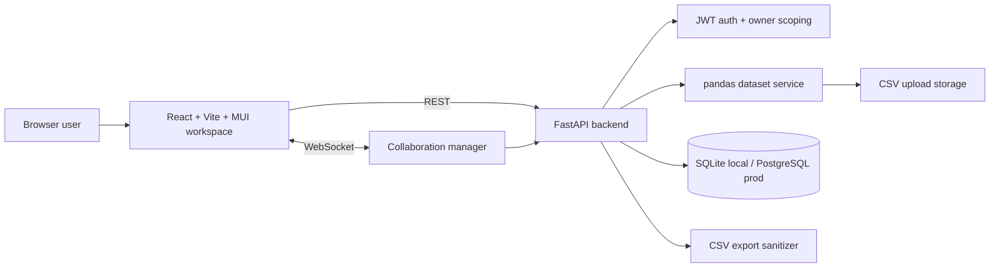

<h1 align="center">SigmaLite</h1>

<p align="center">
  <strong>A beta-grade collaborative data workspace for CSV analysis, spreadsheet edits, formulas, charts, comments, and realtime review.</strong>
</p>

<p align="center">
  <a href="https://github.com/Taz33m/sigma-lite/actions/workflows/ci.yml"></a>
  
  
  
  
</p>

## TL;DR

SigmaLite is a small, inspectable alternative to heavyweight BI tools for the
first mile of tabular analysis: upload a CSV, create a sheet, edit data, filter
rows, run aggregate formulas, save charts, leave comments, and collaborate in
realtime.

The project is intentionally honest about its boundary: it is not trying to be
Excel, Airtable, or a full warehouse-backed analytics suite. It is a
production-conscious beta candidate for teams that need a focused data review
surface with tests, migrations, auth, and deployment guardrails already in
place.

## Best Way To Review

Run the product loop first, then read the code:

```bash
# Backend
cd backend
python -m venv venv
source venv/bin/activate
pip install -r requirements.txt
cp .env.example .env
alembic upgrade head
uvicorn app.main:app --reload --port 8000
```

```bash
# Frontend
cd frontend
npm install
cp .env.example .env
npm run dev
```

Open `http://localhost:5173`, register, upload a CSV, create a sheet, edit a
cell, add a filter, run a formula, save a chart, add a comment, reload, and
export CSV.

For automated review:

```bash
cd backend && uv run python -m pytest -q
cd frontend && npm test -- --run
cd frontend && npm run build
cd frontend && npm run test:e2e -- --project=chromium
```

## Why This Matters

Most CSV workflows fall into an awkward gap:

- spreadsheets are fast but hard to govern;
- BI tools are powerful but heavy for quick review loops;
- notebooks are flexible but hostile to non-technical collaborators;
- internal tools often skip persistence, auth, comments, and tests.

SigmaLite targets that gap. It gives a reviewer a durable workspace around a
dataset without forcing the team to stand up a full analytics platform.

## Current Artifact Proof

| Surface | Evidence |
| --- | --- |
| Backend API | `pytest` covers auth, datasets, filters, formulas, comments, charts, exports, rate limits, config guards, and a 10k-row smoke path |
| Frontend UI | Vitest covers workspace helpers and state transitions |
| Product loop | Playwright covers register/login, upload, sheet open, pagination, cell persistence, filters, formulas, chart rendering, comments, and CSV export |
| Database | Alembic fresh migration creates `users`, `datasets`, `sheets`, `charts`, `comments`, and `alembic_version` |
| Release checks | GitHub Actions runs backend tests, migration smoke, frontend tests, build, and Chromium E2E |
| Production posture | Production mode rejects weak secrets, disabled auth, and wildcard CORS |

## What It Implements

| Area | Implemented |
| --- | --- |
| Auth | Register, login, refresh token rotation, current-user endpoint, owner-scoped resources |
| Uploads | CSV validation, size limits, schema inference, safe stored filenames |
| Sheets | Create/open sheets backed by uploaded datasets and saved workspace config |
| Grid | Paginated MUI data grid, inline cell edits, persisted CSV-backed updates |
| Filters | Validated filter API and frontend filter builder |
| Formulas | Aggregate formulas including column names, A1 ranges, and column letters such as `SUM(A1:A5)`, `AVG(B:B)`, `COUNT(A:A)` |
| Charts | Bar, line, scatter, and pie charts with saved chart configs and rendered previews |
| Comments | Sheet-level and selected-cell comments with reload persistence |
| Realtime | WebSocket presence, cursor activity, comment broadcasts, and cell update activity |
| Export | CSV export with formula-injection neutralization for spreadsheet apps |
| Operations | Alembic migrations, CI, E2E smoke, documented deployment checklist |

## Architecture



The backend owns validation, authentication, dataset processing, persistence,
formula evaluation, comments, charts, and collaboration events. The frontend
owns the workspace interaction model: upload flow, grid editing, filters,
formula controls, chart rendering, comments, export UX, and realtime state.

More detail: [`docs/ARCHITECTURE.md`](docs/ARCHITECTURE.md).

## Command Surface

```bash
# Backend tests
cd backend && uv run python -m pytest -q

# Fresh SQLite migration smoke
cd backend
rm -f migration_smoke.db
DATABASE_URL=sqlite:///./migration_smoke.db \
  SECRET_KEY=migration-smoke-secret-with-enough-entropy \
  uv run alembic upgrade head

# Frontend tests and build
cd frontend && npm test -- --run
cd frontend && npm run build

# Browser product-loop smoke
cd frontend && npm run test:e2e -- --project=chromium

# Frontend production dependency gate
cd frontend && npm audit --omit=dev --audit-level=high
```

The Playwright smoke starts an isolated backend on `127.0.0.1:8001` and Vite
frontend on `127.0.0.1:5174`.

## API Surface

| Route | Method | Purpose |
| --- | --- | --- |
| `/health` | `GET` | Health check |
| `/api/auth/register` | `POST` | Create user |
| `/api/auth/login` | `POST` | Issue access and refresh tokens |
| `/api/auth/refresh` | `POST` | Rotate tokens |
| `/api/auth/me` | `GET` | Current user |
| `/api/datasets` | `GET`, `POST` | List or upload datasets |
| `/api/datasets/{id}/data` | `GET` | Paginated rows |
| `/api/datasets/{id}/filter` | `POST` | Filter rows |
| `/api/datasets/{id}/aggregate` | `POST` | Aggregate a column |
| `/api/datasets/{id}/cell` | `PATCH` | Persist one cell update |
| `/api/sheets` | `GET`, `POST` | List or create sheets |
| `/api/sheets/{id}` | `GET`, `PUT`, `DELETE` | Sheet metadata/config |
| `/api/sheets/{id}/comments` | `GET`, `POST` | Sheet and cell comments |
| `/api/charts` | `GET`, `POST` | List or create charts |
| `/api/charts/{id}` | `GET`, `PUT`, `DELETE` | Chart metadata/config |
| `/ws/collaborate/{sheet_id}` | WebSocket | Presence, cursors, comments, update activity |

## Local Configuration

Backend configuration lives in `backend/.env`:

```env
DATABASE_URL=sqlite:///./sigmalite.db
SECRET_KEY=replace-with-a-long-random-local-secret
ALLOWED_ORIGINS=http://localhost:5173,http://127.0.0.1:5173
DISABLE_AUTH=False
ENVIRONMENT=development
```

Frontend configuration lives in `frontend/.env`:

```env
VITE_API_URL=http://localhost:8000
VITE_DISABLE_AUTH=false
```

`DISABLE_AUTH=True` is a local demo convenience only. Production mode rejects
disabled auth, weak/default secrets, and wildcard CORS.

## Claims And Non-Claims

| Claim | Status |
| --- | --- |
| A reviewer can complete the core CSV-to-sheet-to-chart-to-comment loop | Implemented and E2E-covered |
| API resources are scoped to authenticated owners | Implemented |
| Local development requires no external services | Implemented with SQLite and local file storage |
| PostgreSQL-oriented deployment is supported | Supported through SQLAlchemy/Alembic configuration |
| Full spreadsheet formula parity | Not claimed |
| CRDT/OT collaborative editing | Not claimed |
| Warehouse-scale dataset processing | Not claimed |
| Full team sharing and permissions | Not claimed |

## Known Limits

- Cell edits are last-write-wins.
- Dataset rows are currently stored in CSV files.
- Formula support is aggregate-focused, not a general calculation engine.
- CSV export covers the visible/current grid result.
- In-process rate limiting is single-process protection, not a WAF.
- Realtime collaboration covers presence, cursors, comments, and update
  signals; it is not a full sharing or permissions system.

## Repository Layout

```text
backend/                 FastAPI app, Alembic migrations, pytest suite
frontend/                React/Vite workspace, Vitest, Playwright E2E
docs/ARCHITECTURE.md     System design and data-flow notes
docs/DEVELOPMENT.md      Setup, migrations, testing, deployment checklist
docs/DISABLE_AUTH.md     Local auth-bypass behavior and risks
.github/workflows/ci.yml CI release-candidate checks
```

## Production Notes

Recommended production posture:

- PostgreSQL for `DATABASE_URL`.
- Durable storage for uploaded CSV files.
- A long random `SECRET_KEY` managed as a secret.
- Explicit `ALLOWED_ORIGINS`.
- HTTPS at the platform or load balancer.
- Platform/WAF-level rate limiting in front of the app.
- Database and upload backups.
- `alembic upgrade head` as a release step.

Deployment smoke checklist: [`docs/DEVELOPMENT.md`](docs/DEVELOPMENT.md#deployment-smoke-checklist).

## Contributing

Contributor workflow is in [`CONTRIBUTING.md`](CONTRIBUTING.md). Security
reporting is in [`SECURITY.md`](SECURITY.md).

## License

MIT. See [`LICENSE`](LICENSE).
